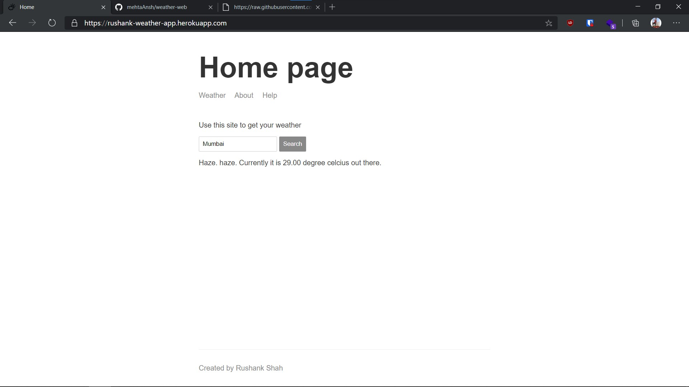
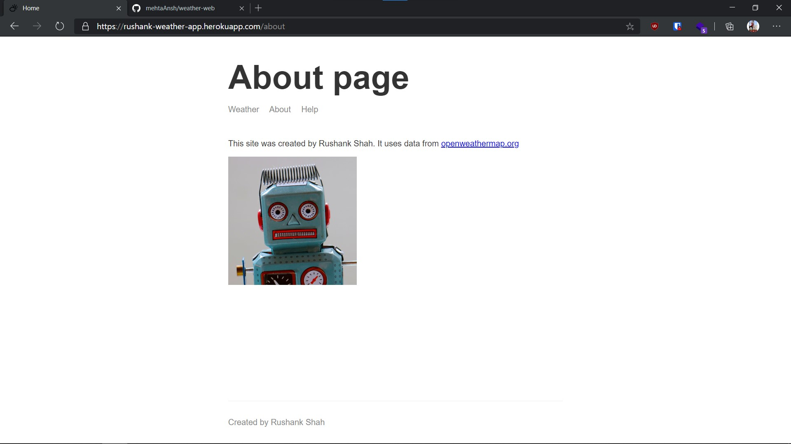

# Weather Web

An application that gives you the weather from WeatherAPI on the city you entered in the field.

# Installing dependencies:

> npm install

A demo of this app is available at : https://rushank-weather-app.herokuapp.com/

# Screenshots:

